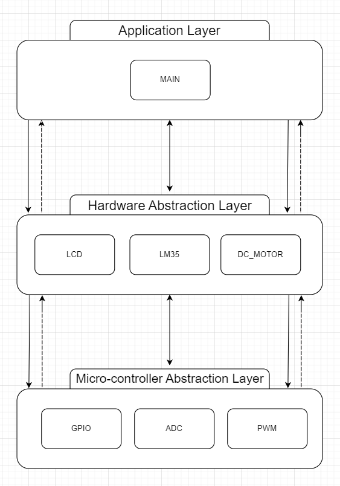

# Fan Controller
An embedded system project that simulates a fan controller on proutes using a 3-layer modular architecture. 

# Workflow
The system will adjust the fan speed based on a temperature read from a sensor. It will be adjusted as follows : 
* temperature
  * **less than 30** : The fan is off. 
  * **greater than or equal to 30** : the fan work wiht 25% of it's maximum speed.
  * **greater than or equal to 60** : the fan work wiht 50% of it's maximum speed.
  * **greater than or equal to 90** : the fan work wiht 75% of it's maximum speed.
  * **greater than or equal to 120** : the fan work wiht 100% of it's maximum speed.

# Architecture & Modules
  

# Proteus Circuit
  

# Main Functionalities  
* The system will NOT update the LCD unless the value actually changed. 
* Modules independency. Each module will preforme it's purpose and handle it's own errors.
* Error handling and chekcing.
* High precision ADC conversion.
* 8-bit LCD mode.
* Dynamic configuration for some modules.
* static configuration for all modules.

# Implemented Features  
 * All modules are highly portable and configurable.
 * Well-documnted.
 * Consistency in error handling and checking.
 * Modular design.
 * Communitcatable Modules ( Each module will always return a response with it's state ).

# Feautre Extensions 
There is A LOT that can be extended on this project some of which are : 
 * simulating the temperature changing based on the fa speed. '
 * adding extra sensors to get more information about the fan it-slef.
 * negative temperature handling. 
 * Anti-clock wise fan usage ( for heating up the motor ).
 * Double fan usage for extreme heat managment.
